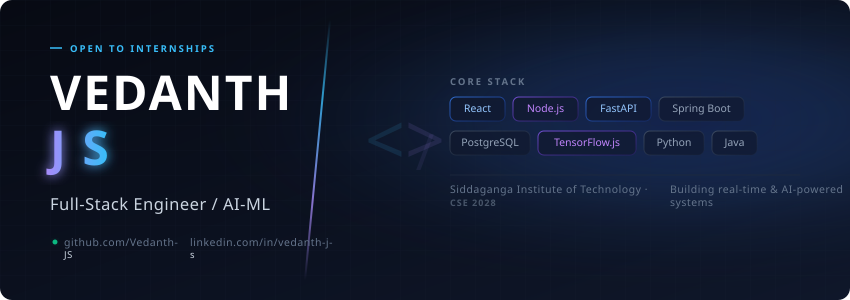

  <picture>
    <source media="(prefers-color-scheme: dark)" srcset="./assets/dark.svg">
    <source media="(prefers-color-scheme: light)" srcset="./assets/light.svg">
    
  </picture>

<h1 align="center">Hi 👋, I'm Vedanth J S</h1>

<h3 align="center">
Computer Science Engineering Student • Full Stack Developer • Java Developer • AI & Machine Learning Enthusiast
</h3>

  

  

  

  

---

## 🐍 Contribution Grid

<picture>
  <source media="(prefers-color-scheme: dark)" srcset="https://raw.githubusercontent.com/Vedanth-JS/Vedanth-JS/output/github-contribution-grid-snake-dark.svg">
  <source media="(prefers-color-scheme: light)" srcset="https://raw.githubusercontent.com/Vedanth-JS/Vedanth-JS/output/github-contribution-grid-snake.svg">
  
</picture>

