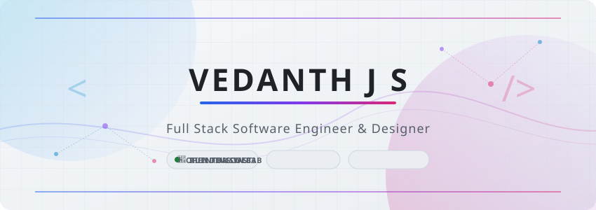

<p align="center">
  <picture>
    <source media="(prefers-color-scheme: dark)" srcset="assets/dark.svg">
    <source media="(prefers-color-scheme: light)" srcset="assets/light.svg">
    
  </picture>
</p>

<h1 align="center">Hi 👋, I'm Vedanth J S</h1>

<h3 align="center">
Computer Science Engineering Student • Full Stack Developer • Java Developer • AI & Machine Learning Enthusiast
</h3>

<p align="center">

</p>

<p align="center">
<a href="https://github.com/Vedanth-JS">

</a>

<a href="mailto:vvedanth72@gmail.com">

</a>

<a href="https://leetcode.com/vedanth_1_8">

</a>

<a href="https://linkedin.com/in/vedanth-j-s">

</a>
</p>

---

# 💫 About Me

```java
public class Vedanth {

    String education = "B.E. Computer Science Engineering";

    String location = "Karnataka, India";

    String currentFocus = "NeetCode 150 • Spring Boot • React";

    String[] interests = {
        "Java",
        "Full Stack Development",
        "Artificial Intelligence",
        "Machine Learning",
        "System Design",
        "Open Source"
    };

}
```

---

# 🚀 Current Focus

- 💻 Building Full Stack Applications
- ☕ Mastering Java & Spring Boot
- ⚛️ Learning React & Next.js
- 🤖 Exploring Artificial Intelligence & Machine Learning
- 📚 Learning System Design
- 🔥 Solving NeetCode 150 & LeetCode Problems

---

# 🛠️ Tech Stack

### Languages

<p align="center">

</p>

### Frontend

<p align="center">

</p>

### Backend

<p align="center">

</p>

### Database

<p align="center">

</p>

### DevOps & Tools

<p align="center">

</p>

---

# 📊 GitHub Analytics

<p align="center">


</p>

---

# 🔥 GitHub Streak

<p align="center">


</p>

---

# 📈 Contribution Graph

<p align="center">


</p>

---

# 📂 Featured Repositories

<p align="center">
  <a href="https://github.com/Vedanth-JS/smart-traffic-management">
    
  </a>
  <a href="https://github.com/Vedanth-JS/AI-Girlfriend">
    
  </a>
</p>
<p align="center">
  <a href="https://github.com/Vedanth-JS/AI-Resume-Screening-System">
    
  </a>
  <a href="https://github.com/Vedanth-JS/Online-Exam-Cheating-Detection">
    
  </a>
</p>
<p align="center">
  <a href="https://github.com/Vedanth-JS/banking-app">
    
  </a>
  <a href="https://github.com/Vedanth-JS/neetcode-submissions">
    
  </a>
</p>

---

# 🎯 2026 Goals

- ✅ Complete NeetCode 150
- ✅ Master Spring Boot
- ✅ Build 10+ Full Stack Projects
- ✅ Learn Docker & AWS
- ✅ Learn System Design
- ✅ Contribute to Open Source

---

# 📚 Currently Learning

```text
☕ Java               ████████████████████░
🌱 Spring Boot        █████████████████░░░
⚛️ React              ███████████████░░░░░
🐳 Docker             ███████████░░░░░░░░░
☁️ AWS                █████████░░░░░░░░░░░
🤖 Machine Learning   █████████████░░░░░░░
📖 System Design      ████████░░░░░░░░░░░░
```

---

# 🌟 Fun Facts

- 💻 I enjoy solving DSA problems.
- ☕ Coffee keeps me productive while coding.
- 🤖 I'm passionate about AI and Machine Learning.
- 🌱 I enjoy learning new technologies.
- 🚀 Always building something new.

---

# 💬 Favorite Quote

> "First, solve the problem. Then, write the code."  
> — John Johnson

---

# 📫 Connect With Me

<p align="center">

<a href="https://github.com/Vedanth-JS">

</a>

<a href="mailto:vvedanth72@gmail.com">

</a>

<a href="https://linkedin.com/in/vedanth-j-s">

</a>

</p>

---

<p align="center">

</p>

<p align="center">

</p>
